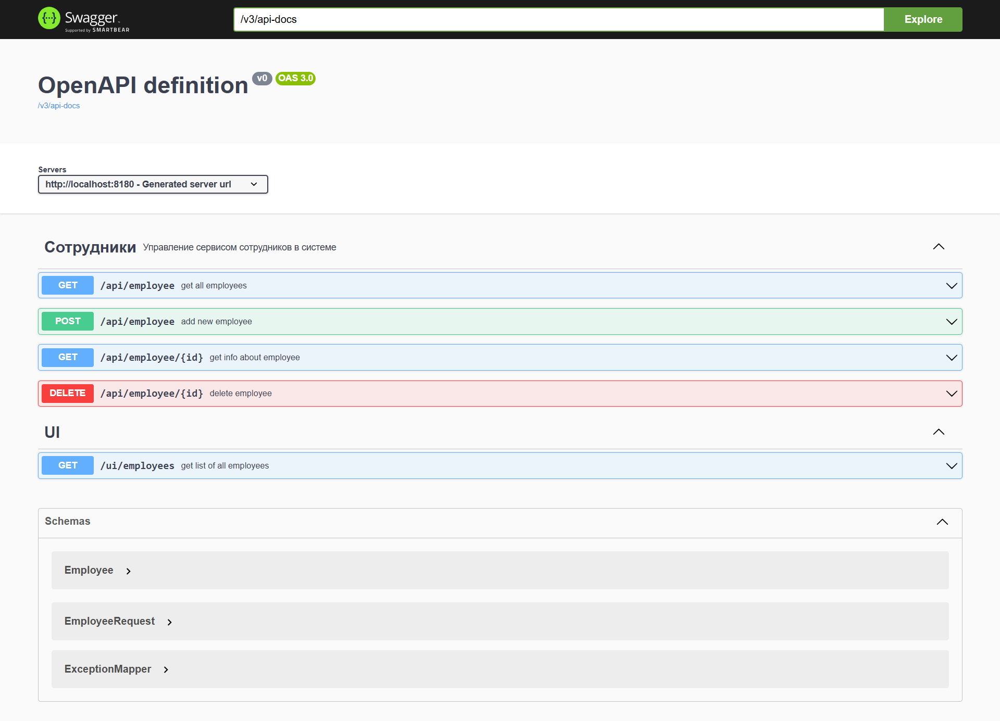
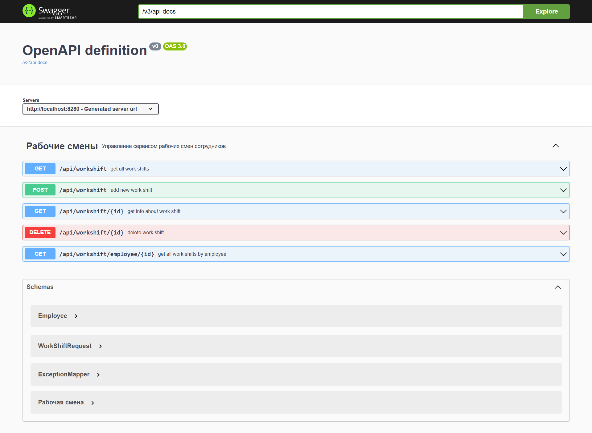
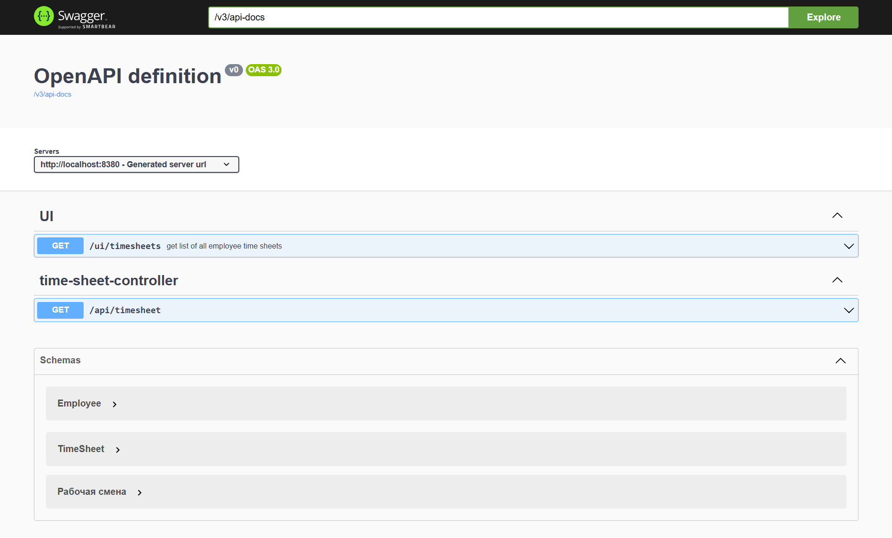
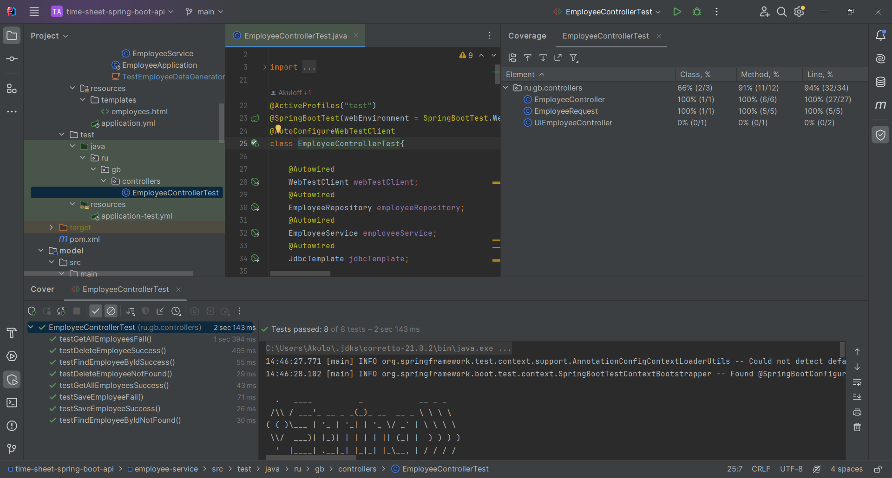
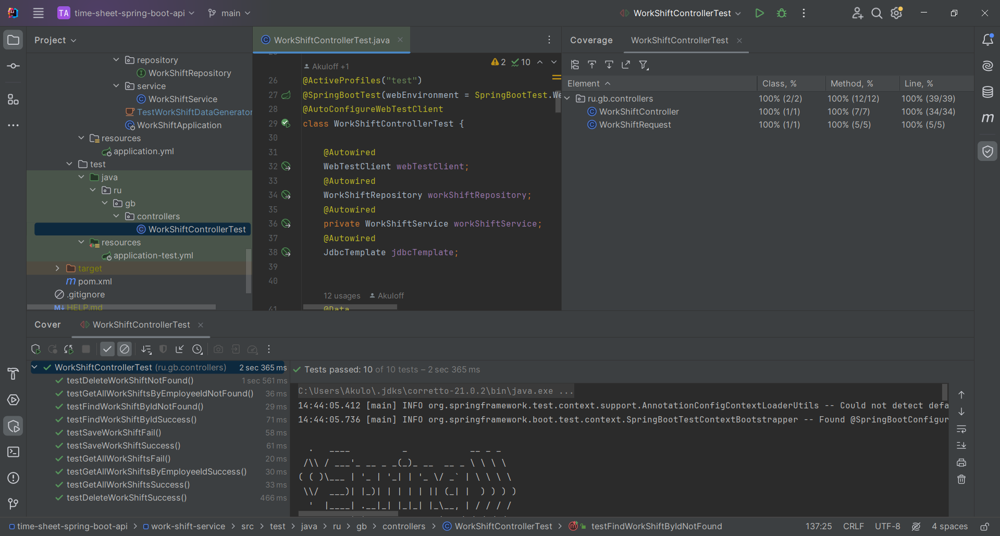

## Разработка ИС «Табель» для учета рабочего времени сотрудников строительной организации.

### Анализ предметной области и актуальность разработки состоит в следующем: 

За более чем десятилетний стаж работы в строительных компаниях различной величины, мной был выявлен один общий слабый 
момент, недооценённый на мой взгляд, и отнимающий ежемесячно у производителей работ (ПР) до одной-двух рабочих смен 
(в зависимости от количества работников подразделения) – учёт рабочего времени сотрудников. 

Зачастую, ПР люди в 
возрасте, не владеют функционалом Microsoft Excel и ведут его по старинке - на листе бумаги, расчерчивая табличку 
с ФИО сотрудника, его «часовой ставкой», отработанными часами в течение дней текущего месяца, отметками отсутствия 
и т.п, или вообще никак не структурируя, а просто записывая куда-нибудь себе в блокнот-ежедневник. 
В конце месяца бухгалтерия компании запрашивает сумму причитающейся оплаты труда по сотрудникам. 
ПР откладывает все дела и садится за ручные подсчёты. 

У данного метода есть следующие недостатки: 

- получение требуемой информации отнимает много времени;
- существует риск появления ошибок из-за человеческого фактора;
- сотрудник сам может запросить у ПР расчёт своих смен «чтобы свериться», при получении выплаты, не соответствующей его собственным расчётам. 

---

### Цель данной работы: 

Разработка информационной системы с единой базой данных (БД) с раздельным доступом к ресурсам. 

### Функционал разрабатываемого сервиса: 
1. Сервис сотрудников и учёта рабочих смен.

    Доступ у соответствующего ответственного лица: 
    - ведение списка сотрудников;
    - ведение учёта рабочего времени сотрудников предприятия;
    - учет причин отсутствия на работе: отпуск, больничный, отгул, и т.д.;
    - назначение часовой ставки оплаты труда сотрудника, премирование, депремирование; 

2. Сервис бизнес-логики, где хранится БД и производятся требуемые расчёты. Доступ у разработчика.

3. Сервис табелей. Доступ у авторизованных пользователей отдельные для бухгалтерии и сотрудников.
   - формируются листы отчётности.
   
---

### Порядок запуска: 

1. Employee-service
2. Work-shift-service
3. Discovery-service
4. Time-sheet-service

---

### Реализовано на данный момент:
- Структура БД, слой репозиториев
- Микросервисы управления коллекциями сотрудников, рабочих смен, формирования табелей сотрудников
- Rest-контроллеры
- Swagger
  * Сотрудники [спецификация OAS](https://github.com/MikhailAkulov/time-sheet-spring-boot-api/blob/main/image/localhost8180v3ApiDocs.png)
  
  [развёрнутый скриншот](https://github.com/MikhailAkulov/time-sheet-spring-boot-api/blob/main/image/localhost8180SwaggerFull.png)
  * Рабочие смены [спецификация OAS](https://github.com/MikhailAkulov/time-sheet-spring-boot-api/blob/main/image/localhost8280v3ApiDocs.png)
    
    [развёрнутый скриншот](https://github.com/MikhailAkulov/time-sheet-spring-boot-api/blob/main/image/localhost8280SwaggerFull.png)
  * Табели [спецификация OAS](https://github.com/MikhailAkulov/time-sheet-spring-boot-api/blob/main/image/localhost8380v3ApiDocs.png)
    
    [развёрнутый скриншот](https://github.com/MikhailAkulov/time-sheet-spring-boot-api/blob/main/image/localhost8380SwaggerFull.png)
- Служба обнаружения `service discovery Eureka` [полный скриншот](https://github.com/MikhailAkulov/time-sheet-spring-boot-api/blob/main/image/EurekaApps.png)
- UI с использованием шаблонизатора `Thymeleaf`
- Тесты контроллеров
  
  

1. [Модуль сущностей](https://github.com/MikhailAkulov/time-sheet-spring-boot-api/tree/main/model/src/main/java/ru/gb/api)
   * [Сотрудник](https://github.com/MikhailAkulov/time-sheet-spring-boot-api/blob/main/model/src/main/java/ru/gb/api/Employee.java)
   * [Рабочая смена](https://github.com/MikhailAkulov/time-sheet-spring-boot-api/blob/main/model/src/main/java/ru/gb/api/WorkShift.java)
   * [Табель](https://github.com/MikhailAkulov/time-sheet-spring-boot-api/blob/main/model/src/main/java/ru/gb/api/TimeSheet.java)
2. [Модуль сервиса сотрудников](https://github.com/MikhailAkulov/time-sheet-spring-boot-api/tree/main/employee-service/src/main/java/ru/gb)
   * [Контроллер](https://github.com/MikhailAkulov/time-sheet-spring-boot-api/blob/main/employee-service/src/main/java/ru/gb/controllers/EmployeeController.java) возвращает JSON [см. скриншот](https://github.com/MikhailAkulov/time-sheet-spring-boot-api/blob/main/image/localhost8180ApiEmployee.png)
   * [Репозиторий](https://github.com/MikhailAkulov/time-sheet-spring-boot-api/blob/main/employee-service/src/main/java/ru/gb/repository/EmployeeRepository.java)
   * [Сервис](https://github.com/MikhailAkulov/time-sheet-spring-boot-api/blob/main/employee-service/src/main/java/ru/gb/service/EmployeeService.java)
   * [UIController](https://github.com/MikhailAkulov/time-sheet-spring-boot-api/blob/main/employee-service/src/main/java/ru/gb/controllers/UiEmployeeController.java)
   * Файл [TestEmployeeDataGenerator](https://github.com/MikhailAkulov/time-sheet-spring-boot-api/blob/main/employee-service/src/main/java/ru/gb/TestEmployeeDataGenerator.java)
   нужен для тестовой генерации 5 сотрудников при запуске (на время запуска тестов код необходимо исключать)
   * [Тесты](https://github.com/MikhailAkulov/time-sheet-spring-boot-api/blob/main/employee-service/src/test/java/ru/gb/controllers/EmployeeControllerTest.java)
   * Файл конфигурации [yaml](https://github.com/MikhailAkulov/time-sheet-spring-boot-api/blob/main/employee-service/src/main/resources/application.yml)
   * [Шаблонизатор](https://github.com/MikhailAkulov/time-sheet-spring-boot-api/blob/main/employee-service/src/main/resources/templates/employees.html), [см. скриншот](https://github.com/MikhailAkulov/time-sheet-spring-boot-api/blob/main/image/localhost8180UiEmployees.png)
   * [pom](https://github.com/MikhailAkulov/time-sheet-spring-boot-api/blob/main/employee-service/pom.xml)
   * [Точка входа](https://github.com/MikhailAkulov/time-sheet-spring-boot-api/blob/main/employee-service/src/main/java/ru/gb/EmployeeApplication.java)
3. [Модуль рабочих смен](https://github.com/MikhailAkulov/time-sheet-spring-boot-api/tree/main/work-shift-service/src/main/java/ru/gb)
   * [Контроллер](https://github.com/MikhailAkulov/time-sheet-spring-boot-api/blob/main/work-shift-service/src/main/java/ru/gb/controllers/WorkShiftController.java) возвращает JSON [см. скриншот](https://github.com/MikhailAkulov/time-sheet-spring-boot-api/blob/main/image/localhost8280ApiWorkshift.png)
   * [Репозиторий](https://github.com/MikhailAkulov/time-sheet-spring-boot-api/blob/main/work-shift-service/src/main/java/ru/gb/repository/WorkShiftRepository.java)
   * [Сервис](https://github.com/MikhailAkulov/time-sheet-spring-boot-api/blob/main/work-shift-service/src/main/java/ru/gb/service/WorkShiftService.java)
   * Файл [TestWorkShiftDataGenerator](https://github.com/MikhailAkulov/time-sheet-spring-boot-api/blob/main/work-shift-service/src/main/java/ru/gb/TestWorkShiftDataGenerator.java)
     нужен для тестовой генерации 15 рабочих смен работникам при запуске (на время запуска тестов код необходимо исключать)
   * [Тесты](https://github.com/MikhailAkulov/time-sheet-spring-boot-api/blob/main/work-shift-service/src/test/java/ru/gb/controllers/WorkShiftControllerTest.java)
   * Файл конфигурации [yaml](https://github.com/MikhailAkulov/time-sheet-spring-boot-api/blob/main/work-shift-service/src/main/resources/application.yml)
   * [pom](https://github.com/MikhailAkulov/time-sheet-spring-boot-api/blob/main/work-shift-service/pom.xml)
   * [Точка входа](https://github.com/MikhailAkulov/time-sheet-spring-boot-api/blob/main/work-shift-service/src/main/java/ru/gb/WorkShiftApplication.java)
4. [Модуль табелей учёта рабочих смен](https://github.com/MikhailAkulov/time-sheet-spring-boot-api/tree/main/time-sheet-service/src/main/java/ru/gb)
   * [Контроллер](https://github.com/MikhailAkulov/time-sheet-spring-boot-api/blob/main/time-sheet-service/src/main/java/ru/gb/controllers/TimeSheetController.java) возвращает JSON [см. скриншот](https://github.com/MikhailAkulov/time-sheet-spring-boot-api/blob/main/image/localhost8380ApiTimesheet.png)
   * [UIController](https://github.com/MikhailAkulov/time-sheet-spring-boot-api/blob/main/time-sheet-service/src/main/java/ru/gb/controllers/UiTimeSheetController.java)
   * [EmployeeProvider](https://github.com/MikhailAkulov/time-sheet-spring-boot-api/blob/main/time-sheet-service/src/main/java/ru/gb/providers/EmployeeProvider.java)
   * [WorkShiftProvider](https://github.com/MikhailAkulov/time-sheet-spring-boot-api/blob/main/time-sheet-service/src/main/java/ru/gb/providers/WorkShiftProvider.java)
   * [Шаблонизатор](https://github.com/MikhailAkulov/time-sheet-spring-boot-api/blob/main/time-sheet-service/src/main/resources/templates/timesheets.html), [см. скриншот](https://github.com/MikhailAkulov/time-sheet-spring-boot-api/blob/main/image/localhost8380UiTimesheets.png)
   * Файл конфигурации [yaml](https://github.com/MikhailAkulov/time-sheet-spring-boot-api/blob/main/time-sheet-service/src/main/resources/application.yml)
   * [pom](https://github.com/MikhailAkulov/time-sheet-spring-boot-api/blob/main/time-sheet-service/pom.xml)
   * [Точка входа](https://github.com/MikhailAkulov/time-sheet-spring-boot-api/blob/main/time-sheet-service/src/main/java/ru/gb/TimeSheetApplication.java)
5. Discovery-service
   * [Точка входа](https://github.com/MikhailAkulov/time-sheet-spring-boot-api/blob/main/discovery-service/src/main/java/ru/gb/DiscoveryService.java)
   * Файл конфигурации [yaml](https://github.com/MikhailAkulov/time-sheet-spring-boot-api/blob/main/discovery-service/src/main/resources/application.yml)
   * [pom](https://github.com/MikhailAkulov/time-sheet-spring-boot-api/blob/main/discovery-service/pom.xml)

### Стек: Spring Boot, Spring Data JPA, Spring Web, Spring WebFlux, Spring Eureka, Spring Configuration Processor, Swagger, REST API, H2, Lombok, Thymeleaf, JavaFaker, Maven.